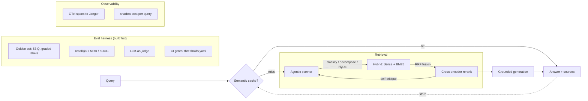

# agentic-rag

An Agentic RAG system built **eval-first**: the golden dataset and measurement
harness are built *before* any retrieval improvement, and every upgrade —
hybrid retrieval, cross-encoder reranking, an agentic re-query loop — has to
**earn its place with a measured delta** on the golden set. Some earned it;
one didn't, and the table says so.

> "You can't improve what you can't measure." This project inverts the amateur
> workflow (build a fancy pipeline, eyeball 5 questions, ship) by making the
> measurement the first-class artifact and every component accountable to a number.

Total spend: **\$0** — generation and the LLM-as-judge run on local Ollama,
embeddings and reranking on local sentence-transformers, CI on the free tier.
Cost is still tracked, as **shadow-dollars** (tokens priced at public API rates).

## Architecture



Dense retrieval = pgvector HNSW (cosine, bge-small-en-v1.5). Sparse = PostgreSQL
full-text search. Fusion = Reciprocal Rank Fusion. Reranker =
`cross-encoder/ms-marco-MiniLM-L-6-v2`. Generation = `llama3.1:8b`, judge =
`qwen2.5:7b-instruct` (different family, to blunt self-preference bias). Cache =
Redis 8 vector search. Everything is one pluggable `Retriever` interface, so
serving and evaluation run the identical retrieval code.

## How it finds answers, in plain English

Picture a librarian finding the right pages for your question out of thousands.
The retrieval "modes" (`RAG_RETRIEVAL_MODE`) are that librarian, from
fast-and-rough to slow-and-smart:

- **`dense`** — searches by *gist*: every page and your question become a
  "meaning fingerprint," and it grabs the closest ones. Fast, but blurs exact
  terms like `ef_search`.
- **`rerank`** — `dense` grabs ~50 candidates, then a slower, smarter model reads
  each one *next to your question* and re-sorts them so the best lands on top.
  The big accuracy jump.
- **`agentic`** — `rerank`, plus the system checks its own confidence and, when a
  result looks weak, rewrites the query in the docs' vocabulary and retries
  (capped at 2 tries). Helps vocabulary-mismatch questions; costs extra tokens.

In one line: **dense = fast & rough → rerank = add a smart re-sorter → agentic =
add self-checking + a smart retry.** (`sparse` = keyword search; `hybrid` =
dense+sparse — kept for comparison, but reranking made both redundant here.)

Answering has **two halves that can each fail**: *finding* the right page
(retrieval) and the LLM *reading* it correctly (generation). The eval harness
scores them separately, because a fix to one doesn't fix the other.

## Results (golden set: 46 answerable + 7 negative controls)

### Retrieval

| config | recall@5 | recall@10 | MRR | nDCG@10 | retrieve p50 | Δ recall@5 vs baseline |
|---|---|---|---|---|---|---|
| dense (baseline) | 0.412 | 0.540 | 0.433 | 0.395 | 14 ms | — |
| + hybrid (BM25+RRF) | 0.427 | 0.563 | 0.402 | 0.389 | 36 ms | +3.6% |
| + rerank (cross-encoder) | 0.573 | 0.627 | 0.477 | 0.459 | 526 ms | **+38.9%** |
| + agentic loop | 0.595 | 0.648 | 0.488 | 0.473 | 1516 ms | **+44.3%** |

### Generation (LLM-as-judge, 1–5)

| config | faithfulness | groundedness | relevance | refusal accuracy (negatives) |
|---|---|---|---|---|
| naive dense RAG | 4.65 | 4.59 | 4.13 | 1.00 |
| rerank pipeline | 4.65 | 4.72 | **4.74** | 1.00 |

Better retrieval drives answer **relevance** up +15% (4.13 → 4.74) — the right
chunks reach the generator — while faithfulness stays high (the generator was
already faithful to whatever context it got). This is the end-to-end payoff of
the retrieval work, measured.

### Semantic cache (paraphrase workload)

| metric | value |
|---|---|
| exact-repeat hit rate | 1.00 |
| close-paraphrase hit rate | 0.44 |
| **novel false-hit rate** | **0.00** |
| overall hit rate | 0.63 |
| saved per hit | full retrieve+generate latency + ~\$0.0006 shadow |

## What earned its place, and what didn't (the honest part)

- **Reranking is the load-bearing upgrade.** +39% recall@5, +16% nDCG over
  baseline. It recovers the precision hybrid trades away and then some, at a
  real latency cost (14 ms → ~510 ms — 50 cross-encoder inferences per query).
- **Hybrid (BM25) did NOT earn its place in the final pipeline.** It improves
  recall standalone, but `dense + rerank` ties `hybrid + rerank` — the exact-
  identifier cases BM25 rescued were already in dense's top-50 pool; the
  reranker surfaces them without BM25. Kept in the table, not hidden. On a
  lexical/code corpus it would likely still pay.
- **The agentic loop pays off only for vocabulary-mismatch queries** (+12.5%
  recall@10 on that type; 0% on every other type). It fixed the exact
  async-vs-blocking failure found in Phase 1. Cost: ~219 tokens/query, but a
  classifier fires on every query while only ~17% benefit — documented redesign:
  gate the LLM spend on the confidence heuristic alone. Iteration cap (2) +
  token budget guarantee termination.
- **The cache is precision-first.** Threshold 0.90 tuned on measured paraphrase
  similarities (not guessed) — it accepts a lower paraphrase hit-rate to keep
  the false-hit rate at zero, because a cache that serves the wrong answer is
  worse than no cache.

Full per-phase analysis with per-question breakdowns: [`eval/results/ANALYSIS.md`](eval/results/ANALYSIS.md).

## Eval methodology

- **Golden set** ([methodology](eval/golden/METHODOLOGY.md)): 53 questions across
  four doc sources and five types (factoid / how-to / multi-hop / vocab-mismatch /
  negative-control). Graded labels (primary vs supporting) anchor to a *verbatim
  document span*, materialized to chunk IDs per chunk config — re-chunking never
  silently invalidates labels. No chunk wording leaks into questions (enforced by
  an n-gram overlap check; max observed 0.15).
- **LLM-as-judge** ([rubric](eval/judge/rubric.md)): reference-free scoring
  against the retrieved context, cross-family judge, versioned prompts. The judge
  is itself regression-tested — it must separate a good answer from a seeded
  hallucination by a margin before its scores count.
- **CI eval gates** ([workflow](.github/workflows/eval-gate.yml)): PRs run the
  retrieval suite in CI against absolute floors in
  [`eval/thresholds.yaml`](eval/thresholds.yaml); the generation suite is
  verified against its committed, hash-stamped result (stale or regressed →
  merge blocked). **Live demonstration** ([PR #1](https://github.com/rohitjingar/agentic-rag/pull/1)):
  a PR that drops the bge query-instruction prefix passes `lint` and `test` but
  the `retrieval-gate` catches it — `GATE FAIL: recall@10 0.489 < floor 0.5` —
  and blocks the merge. Unit tests can't catch a quality regression; the golden
  set can.

## Quickstart

```bash
make up        # postgres+pgvector, redis 8, jaeger (docker compose)
make migrate   # versioned SQL migrations
make models    # pull local ollama models (~10 GB, one-time)
uv run python scripts/fetch_corpus.py   # or use the committed corpus in data/corpus
uv run rag-ingest
uv run rag-query "What is the default value of hnsw.ef_search?"
make test

# evals
uv run python -m eval.run --mode rerank --label rerank      # retrieval
uv run python -m eval.judge.runner --label gen              # generation (needs ollama)
uv run python -m eval.cache_eval                            # cache hit-rate
```

Config is environment-only (`.env`, see `.env.example`). Switch pipeline with
`RAG_RETRIEVAL_MODE=dense|sparse|hybrid|rerank|agentic`.

## Stack

Python 3.12 · FastAPI · PostgreSQL 17 + pgvector (HNSW) · PostgreSQL FTS ·
sentence-transformers (bge-small, ms-marco cross-encoder) · Ollama (llama3.1,
qwen2.5) · Redis 8 vector search · OpenTelemetry + Jaeger · Docker Compose · uv ·
ruff · GitHub Actions.
