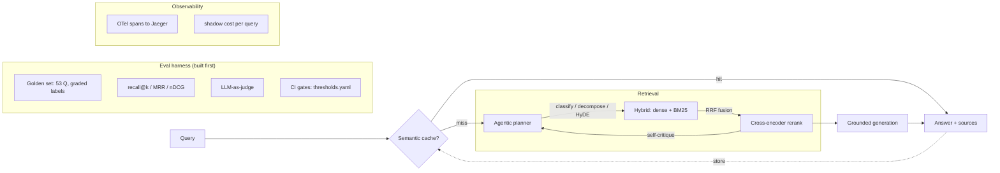

# agentic-rag

An Agentic RAG system (it answers questions from a collection of documents) built
**eval-first**: I built the golden dataset (a fixed set of test questions with
known answers) and the measurement harness *before* touching retrieval (the step
that finds the right pages). Every upgrade — hybrid retrieval (mix meaning search
with keyword search), cross-encoder reranking (a smarter model re-sorts the top
hits), and an agentic re-query loop (the system critiques its own results and
retries) — has to **earn its place with a measured delta** (a real, measured
gain) on the golden set. Some earned it; one didn't, and the table says so.

> "You can't improve what you can't measure." The amateur workflow is to build a
> fancy pipeline, eyeball 5 questions, and ship. This project flips that: the
> measurement is the main artifact, and every component must justify itself with
> a number.

Total spend: **\$0**. Generation and the LLM-as-judge (an LLM that grades the
answers) run on local Ollama. Embeddings (text turned into number lists a
computer can compare) and reranking run on local sentence-transformers. CI runs
on the free tier. Cost is still tracked, as **shadow-dollars** (tokens priced at
public API rates).

## Architecture



Dense retrieval (search by meaning) uses pgvector with an HNSW index (a fast
approximate nearest-neighbor index): cosine distance, `bge-small-en-v1.5`
embeddings. Sparse retrieval (keyword search) uses PostgreSQL full-text search.
Fusion (merging the two ranked lists into one) uses Reciprocal Rank Fusion. The
reranker (the cross-encoder that re-sorts results) is
`cross-encoder/ms-marco-MiniLM-L-6-v2`. Generation (writing the answer) uses
`llama3.1:8b`, and the judge uses `qwen2.5:7b-instruct` — a different model
family, so the judge doesn't favor answers written in its own style
(self-preference bias). The cache is Redis 8 vector search. Everything sits
behind one pluggable `Retriever` interface, so serving and evaluation run the
identical retrieval code.

## How it finds answers, in plain English

Picture a librarian finding the right pages for your question out of thousands.
The retrieval "modes" (`RAG_RETRIEVAL_MODE`) are that librarian, from
fast-and-rough to slow-and-smart:

- **`dense`** — searches by *gist*: every page and your question become a
  "meaning fingerprint," and it grabs the closest ones. Fast, but blurs exact
  terms like `ef_search`.
- **`rerank`** — `dense` grabs ~50 candidates, then a slower, smarter model reads
  each one *next to your question* and re-sorts them so the best lands on top.
  The big accuracy jump.
- **`agentic`** — `rerank`, plus the system checks its own confidence and, when a
  result looks weak, rewrites the query in the docs' vocabulary and retries
  (capped at 2 tries). Helps vocabulary-mismatch questions; costs extra tokens.

In one line: **dense = fast & rough → rerank = add a smart re-sorter → agentic =
add self-checking + a smart retry.** (`sparse` = keyword search; `hybrid` =
dense+sparse — kept for comparison, but reranking made both redundant here.)

Answering has **two halves that can each fail**: *finding* the right page
(retrieval) and the LLM *reading* it correctly (generation). The eval harness
scores them separately, because a fix to one doesn't fix the other.

## Results (golden set: 46 answerable + 7 negative controls)

### Retrieval

| config | recall@5 | recall@10 | MRR | nDCG@10 | retrieve p50 | Δ recall@5 vs baseline |
|---|---|---|---|---|---|---|
| dense (baseline) | 0.412 | 0.540 | 0.433 | 0.395 | 14 ms | — |
| + hybrid (BM25+RRF) | 0.427 | 0.563 | 0.402 | 0.389 | 36 ms | +3.6% |
| + rerank (cross-encoder) | 0.573 | 0.627 | 0.477 | 0.459 | 526 ms | **+38.9%** |
| + agentic loop | 0.595 | 0.648 | 0.488 | 0.473 | 1516 ms | **+44.3%** |

### Generation (LLM-as-judge, 1–5)

| config | faithfulness | groundedness | relevance | refusal accuracy (negatives) |
|---|---|---|---|---|
| naive dense RAG | 4.65 | 4.59 | 4.13 | 1.00 |
| rerank pipeline | 4.65 | 4.72 | **4.74** | 1.00 |

Better retrieval drives answer **relevance** up +15% (4.13 → 4.74): the right
chunks (pieces of a document) reach the generator (the LLM that writes the
answer). Faithfulness (does the answer stick to its sources, with nothing made
up) stays high — the generator was already faithful to whatever context it got.
This is the end-to-end payoff of the retrieval work, measured.

### Semantic cache (paraphrase workload)

| metric | value |
|---|---|
| exact-repeat hit rate | 1.00 |
| close-paraphrase hit rate | 0.44 |
| **novel false-hit rate** | **0.00** |
| overall hit rate | 0.63 |
| saved per hit | full retrieve+generate latency + ~\$0.0006 shadow |

## What earned its place, and what didn't (the honest part)

- **Reranking is the load-bearing upgrade** — the piece doing the real work.
  +39% recall@5 (was the right page in the top 5) and +16% nDCG (a
  ranking-quality score) over baseline. It wins back the precision hybrid gives
  up, and then some, at a real latency cost (14 ms → ~510 ms — 50 cross-encoder
  inferences per query).
- **Hybrid (BM25) did NOT earn its place in the final pipeline.** BM25 is a
  classic keyword-matching algorithm. On its own it improves recall, but
  `dense + rerank` ties `hybrid + rerank`: the exact-identifier cases BM25
  rescued were already in dense's top-50 pool, and the reranker surfaces them
  without BM25. Kept in the table, not hidden. On a lexical/code corpus (a
  document set full of exact terms and code) it would likely still pay.
- **The agentic loop pays off only for vocabulary-mismatch queries** — questions
  that use different words than the documents (+12.5% recall@10 on that type; 0%
  on every other type). It fixed the exact async-vs-blocking failure found in
  Phase 1. Cost: ~219 tokens/query, and a classifier (a small model that labels
  each query) fires on every query while only ~17% benefit. Documented redesign:
  spend the LLM tokens only when the confidence heuristic (a simple rule that
  flags weak results) says a retry is worth it. An iteration cap (2 tries) plus a
  token budget guarantee the loop stops.
- **The cache is precision-first** — it would rather miss than serve a wrong hit.
  The threshold 0.90 was tuned on measured paraphrase similarities, not guessed.
  It accepts a lower paraphrase hit-rate to keep the false-hit rate (returning a
  cached answer for a question that isn't really the same) at zero, because a
  cache that serves the wrong answer is worse than no cache.

Full analysis of each phase, with per-question breakdowns: [`eval/results/ANALYSIS.md`](eval/results/ANALYSIS.md).

## Eval methodology

- **Golden set** ([methodology](eval/golden/METHODOLOGY.md)): 53 questions across
  four doc sources and five types (factoid / how-to / multi-hop / vocab-mismatch /
  negative-control — questions the docs can't answer, used to check the system
  refuses). Each question has graded labels (which pages are primary vs
  supporting). Every label points to a *verbatim document span* (exact wording
  from the source) and is turned into chunk IDs for the current chunk config, so
  re-chunking (splitting the docs differently) never silently invalidates the
  labels. No chunk wording leaks into the questions — an n-gram overlap check
  (measures runs of copied words) enforces this, with a max observed 0.15.
- **LLM-as-judge** ([rubric](eval/judge/rubric.md)): the judge scores each answer
  against the retrieved context with no reference answer to compare against
  (reference-free), uses a cross-family judge (a different model family), and runs
  versioned prompts (prompt text tracked like code). The judge is itself
  regression-tested: before its scores count, it must separate a good answer from
  a seeded hallucination (a deliberately planted wrong answer) by a clear margin.
- **CI eval gates** ([workflow](.github/workflows/eval-gate.yml)): PRs run the
  retrieval suite in CI against absolute floors (hard minimums) in
  [`eval/thresholds.yaml`](eval/thresholds.yaml); the generation suite is checked
  against its committed, hash-stamped result (a saved score tagged with a hash of
  its inputs) — if it is stale or has regressed (dropped), the merge is blocked.
  **Live demonstration** ([PR #1](https://github.com/rohitjingar/agentic-rag/pull/1)):
  a PR that drops the bge query-instruction prefix (a required bit of text added
  to every query) passes `lint` and `test`, but the `retrieval-gate` catches it —
  `GATE FAIL: recall@10 0.489 < floor 0.5` — and blocks the merge. Unit tests
  can't catch a quality regression; the golden set can.

## Quickstart

```bash
make up        # postgres+pgvector, redis 8, jaeger (docker compose)
make migrate   # versioned SQL migrations
make models    # pull local ollama models (~10 GB, one-time)
uv run python scripts/fetch_corpus.py   # or use the committed corpus in data/corpus
uv run rag-ingest
uv run rag-query "What is the default value of hnsw.ef_search?"
make test

# evals
uv run python -m eval.run --mode rerank --label rerank      # retrieval
uv run python -m eval.judge.runner --label gen              # generation (needs ollama)
uv run python -m eval.cache_eval                            # cache hit-rate
```

All config comes from the environment (`.env`, see `.env.example`). Switch the
pipeline with `RAG_RETRIEVAL_MODE=dense|sparse|hybrid|rerank|agentic`.

## Stack

Python 3.12 · FastAPI · PostgreSQL 17 + pgvector (HNSW) · PostgreSQL FTS ·
sentence-transformers (bge-small, ms-marco cross-encoder) · Ollama (llama3.1,
qwen2.5) · Redis 8 vector search · OpenTelemetry + Jaeger · Docker Compose · uv ·
ruff · GitHub Actions.
